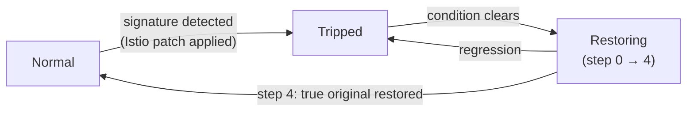

# Cascade Operator

A Kubernetes operator that watches Prometheus for **cascade failure
signatures** across a microservice mesh — a latency/error spike spreading
downstream, a retry storm amplifying load on an already-degraded dependency,
one failing call fanning out into a disproportionate number of others — and
automatically tightens the relevant Istio circuit breaker *before* the
failure completes, then gradually loosens it back once the signal clears.

Istio already has circuit breaking (`DestinationRule` outlier detection,
retry budgets, connection pools). What it doesn't have is anything that
*decides when to use it*: today that's a human, hand-tuning thresholds after
an incident. This project closes that gap for three specific failure shapes.
It's a portfolio piece, not a product — see
[`PLAN.md`](PLAN.md)'s §1 for the full goal statement and why that framing
drives every tradeoff in here.

**License:** [Apache 2.0](LICENSE) · **Contributing:** [CONTRIBUTING.md](CONTRIBUTING.md) · **Security:** [SECURITY.md](SECURITY.md)

## Architecture at a glance

Every reconcile tick (10s, or immediately on a `CascadePolicy` watch event),
the controller queries Prometheus for the protected service and its declared
dependencies, runs three pure detectors against the result, and — if one
trips — patches the Istio object that actually controls that failure mode:

| Signature | Trips on | Primary patch |
|---|---|---|
| Latency/error cascade | upstream p99 latency + downstream error rate both over threshold in the same window | `DestinationRule` `outlierDetection` (eject unhealthy pods faster) |
| Retry storm | dependency:caller request-count ratio over threshold (retries amplifying load) | `VirtualService` `retries.attempts` → 0 (cut the retry budget) |
| Fan-out amplification | downstream call count disproportionate to inbound call count | `DestinationRule` `connectionPool.http` (bulkhead in-flight calls) |

Full reasoning for each choice — including the two secondaries not yet
built and the disjoint-field-set sharing between the first and third rows —
is in [`PLAN.md`](PLAN.md) §2.6. The CRD itself
(`CascadePolicy`: a protected service, its dependency FQDNs, and detection
thresholds) is in §2.3, reproduced in full in
[`config/samples/cascade_v1alpha1_cascadepolicy.yaml`](config/samples/cascade_v1alpha1_cascadepolicy.yaml).

The loop, once tripped, always runs the same way regardless of which
signature fired:



Restoration is a stepwise ramp back toward the exact pre-trip values (not a
traffic-weighted canary — see §2.6 for why), gated by a fresh metrics
check between steps, and a regression during the ramp re-trips immediately
rather than continuing to loosen. If two signatures could both patch the
same host's `DestinationRule` (latency/error-cascade and fan-out
amplification both can, on disjoint fields) and a handoff happens with no
healthy tick in between, the outgoing signature's restore is
force-completed synchronously before the incoming one's trip is applied —
see §2.6's "Signature handoff on a shared object."

## Setup

You need a Kind cluster with Istio installed to see any of this actually
patch something — the detectors themselves are cluster-independent and
unit-tested (`go test ./internal/signatures/...`), but the mitigate/restore
path patches real `DestinationRule`/`VirtualService` objects and needs a
real admission webhook to validate against.

```bash
# 1. Kind cluster (bring your own, or use the one the scaffold smoke test used)
# 2. Istio (pinned version) + Prometheus, on the current kube context
make istio-install
# 3. The demo topology: checkout -> {payments, inventory}, plus the
#    inventory retry-storm fixture and the payments baseline DestinationRule
make demo-deploy
# 4. The CascadePolicy CR that watches checkout-service
kubectl apply -f demo/k8s/cascadepolicy.yaml
# 5. The operator itself, pointed at Prometheus (port-forward it first —
#    see demo/k6/README.md's Terminal 1)
go run ./cmd/main.go --prometheus-url=http://127.0.0.1:19090
```

Full detail on each of those — prerequisites, what gets installed, how to
confirm sidecars are injected, how to hand-query Prometheus — lives in
[`docs/dev-istio.md`](docs/dev-istio.md) (the Kind+Istio mesh itself) and
[`docs/demo-topology.md`](docs/demo-topology.md) (the three demo services
and their control endpoints).

To deploy the operator itself to any cluster (build an image, install the
CRD, run the manager as a `Deployment` rather than `go run` from your host):
`make docker-build docker-push IMG=<registry>/cascade-operator:tag &&
make install && make deploy IMG=<registry>/cascade-operator:tag`. Run
`make help` for the full target list.

## Running the demo

Three k6 scripts, one per signature, each drive load through
`checkout-service` and toggle the right control endpoint at the right point
to induce that signature's exact pattern, then heal it and let restoration
run to completion:

```bash
hack/run-k6-demo.sh fanout-amplification
hack/run-k6-demo.sh latency-error-cascade
hack/run-k6-demo.sh retry-storm
```

Watch it happen in another terminal:

```bash
kubectl get cascadepolicy checkout-service -w
```

You should see `PHASE` move `Normal` → `Tripped` → `Restoring` (with
`RESTORE STEP` counting 0 through 4) → `Normal` over the ~170s each script
runs. **k6 has to run inside the cluster** (`hack/run-k6-demo.sh` does this
as a `Job`) — running it from your host against `kubectl port-forward`'d
URLs bypasses the Istio sidecar and produces empty/`+Inf` metrics for the
ratio-based signatures. Full detail, including which host each script
targets and why, prerequisites, and a couple of known transient-metric
artifacts that are expected and self-correct, is in
[`demo/k6/README.md`](demo/k6/README.md).

## Project status

All three signatures now go detect → mitigate → restore end to end,
including the same-object signature-handoff case. What's still open —
the remaining Istio patch secondaries (latency/error-cascade's
`VirtualService` timeout; retry-storm's `connectionPool` cap), the
operator's own Prometheus metrics, and a Kind-based integration test suite
(today's coverage is unit tests against a fake client plus manual/k6
live-cluster evidence, not an automated integration suite) — is tracked
live in [`PLAN.md`](PLAN.md)'s §3 checklist, which is the source of truth
for what's built; this section won't try to keep a duplicate in sync.
Every unit of work, including the reasoning behind decisions and the bugs
found along the way, has a dated entry in
[`docs/worklog/`](docs/worklog/README.md).

## Repo layout

```
api/v1alpha1/          CascadePolicy CRD types + generated deepcopy
internal/signatures/   Pure detectors: metric snapshot in, verdict out — no k8s/Prometheus deps
internal/metrics/      Prometheus HTTP client (Query → Snapshot)
internal/mitigation/   Istio object mutation logic: trip + restore, per signature
internal/controller/   Reconciler: wires metrics -> detectors -> mitigation/restore dispatch
cmd/                    Manager entrypoint
config/                 Kustomize: CRDs, RBAC, sample CRs (generated except config/samples/)
demo/                   The checkout -> {payments, inventory} demo topology + k6 scripts
docs/                   Kind+Istio dev-env and demo-topology setup notes
docs/worklog/           Dated history of what was built, why, and how
hack/                   Local dev scripts (install Istio, deploy demo, run k6, port-forward)
PLAN.md                 Goal, architecture decisions, and the live checklist
PROPOSALS.md            Queue for proposed changes to PLAN.md's locked decisions
```

## License

Copyright 2026 Gideon Sanni.

Licensed under the Apache License, Version 2.0. See [LICENSE](LICENSE) for the
full text. For how to contribute, see [CONTRIBUTING.md](CONTRIBUTING.md).
